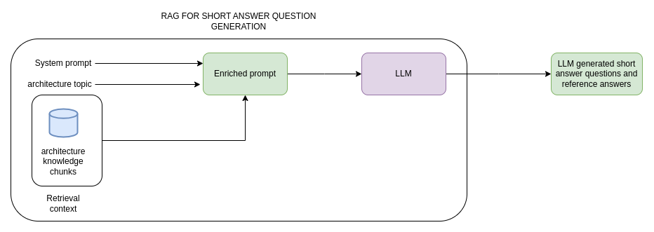

# Monitor software architecture trends & generate certification content

## Overview
Expert architects are responsible for **maintaining and updating certification content** to ensure alignment with **emerging industry trends and evolving best practices**. Currently, this process involves **manual research across industry articles, blogs, research papers, and conference talks**. Architects analyze industry developments, identify relevant topics, and create certification questions based on these insights. 
As the certification process requirements are not explicitly detailed, we assume that expert architects rely on **articles, journals, social media (LinkedIn, Twitter, Medium), podcasts, conference talks, and research papers** to stay updated with emerging trends in software architecture.

## Primary Goal
**HMW automate the identification of emerging software architecture trends and generate expert-level certification questions to assist architects in updating the certification database efficiently?**

Refer here for [detailed business requirements](/business-requirements/ai-content-updates-requirements.md)

## New User Journey / Golden Path using Jobs to be Done Framework

### **Persona:**  
[Chris,Designated Expert Architect](business-requirements/references/designated-expert-architect-persona.md)

### **Main Job:**  
Identify industry-relevant trends and generate expert-level certification questions efficiently.

### **Backstory:**  
Alex is responsible for keeping certification content **up to date** by ensuring **new software architecture trends** are incorporated into certification exams. Manually searching for industry trends, identifying relevant topics, and formulating certification questions is **time-consuming and inefficient**. AI-assisted automation is needed to streamline this process.

### **End Goal of the Main Job:**  
Ensure that **certification content reflects the latest industry advancements** by efficiently **identifying relevant trends and generating expert-validated certification questions**.

### **Job Steps (using universal job map):**
1. **Configure trend sources and search parameters** – Architects define sources and prompts for AI-based industry research.
2. **View AI-generated trend feed** – AI scrapes and presents insights from preconfigured sources[TBD].
3. **Review system-generated certification questions** – AI suggests MCQs, short-answer questions, and case study prompts.
4. **Assess AI-generated reasoning** – Validate AI's justification for trend relevance and question generation.
5. **Modify AI-generated content if necessary** – Experts refine AI-suggested questions and answers.
6. **Finalize and approve questions** – Validated questions are integrated into the certification database.
7. **Monitor AI learning improvements** – AI adjusts its trend analysis and question generation based on expert feedback.

**High level user flow:** [UI Mockup](https://claude.site/artifacts/043388db-7e9e-4716-8b82-8d5ca315adbc?fullscreen=true)

**Key screen:** 


## Architecture Diagrams

### Container Diagram (C2)


New questions and case studies are automatically created using:

- Web search
- Large Language Models (LLMs)
- Embedding models
- Vector databases

**Key Components and Data Flow**

**1. AI Gateway**

- Acts as the interface between the system and the LLM.
- Uses prompt guards and evaluations to ensure quality control of generated content.

**2. Architecture Knowledge Ingestion Service**

- Fetches data from targeted web searches to specific sites and internal documents stored in object store.
- Performs data cleanup and transformation.
- Stores refined information in an Architecture Knowledge Base Vector Store.

**3. Case Study Preparation Service**

- Uses cleaned and structured data to generate new case studies.
- Passes case studies to the Case Study Maintenance Service.

**4. Case Study Maintenance Service**

- Maintains an updated repository of case studies in a Case Study Database.

**5. Aptitude Test Question Preparation Service**

- Generates MCQ-based aptitude test questions based on:
  - Existing knowledge from the vector store
  - LLM-generated insights
- Stores generated questions in the Aptitude Test Questions Database.

**6. Aptitude Test Maintenance Service**

- Maintains valid and updated aptitude test questions(MCQs and short answer questions) in an Aptitude Test Database.

**7. Expert User Interface & Admin API Gateway**

- Designated architect Experts can review and manage test questions, case studies.
- Connected via an Admin API Gateway.

### Flow Diagram

- **Description:** Flow involving chunking of documents, storing in vector store and retrieival by the expert Architect to update the tests
- **Diagram:**


- Document Ingestion and Chunking: The process starts with ingesting documents (HTML, PDF, TXT) which are then broken down into smaller, manageable chunks. This is essential for processing large documents and ensuring relevant sections are used for question and case study generation. Chunking strategy discussed in [ADR](/ADRs/006-adr-architecture-knowledge-chunking-strategy.md).

- Embedding Generation and Vector Storage: The document chunks are fed into an embedding model, creating vector representations. These vectors, capturing the semantic meaning of the text, are stored in a vector store. This allows for efficient similarity searches later on.

- Knowledge Retrieval and LLM Interaction: When the Aptitude quesiton preparation service or case study preparation service requests a question or case study, the system queries the vector store to retrieve relevant document chunks based on semantic similarity. These chunks are then used as context for the Generative AI Model (LLM). The LLM processes this information to generate questions, case studies.

- Aptitude question preparation Service: For test1 MCQs and short answer questions, the system triggers Aptitude question preparation Service on a schedule or on demand. This service interacts with the LLM to generate questions and stores them in an Aptitude test questions database. These questions are pulled by Aptitude test maintenance service when designated expert architects tries to view them in User interface. Designated Expert Architects can drop or modify or add these questions to the tests. The tests are then stored in Aptitude test database

- Case Study preparation Service: For test 2 i.e case study-based exam, the system triggers Case Study preparation Service on a schedule or on demand. This service works in conjunction with the LLM to create case studies, which are then stored in a Case Study Database. These case studies are pulled by Case study maintenance service when designated expert architects tries to view them in User interface. Similar to questions, expert architects can edit, drop or include them in the test.

- Feedback Loop and Iteration: Both the question and case study generation processes involve expert review, allowing for feedback and improvement. The system can also learn from user interactions and refine its search and generation capabilities over time. This iterative process ensures the quality and relevance of the generated content[TBD].

## Constraints

- **Technical Constraints:**
  - Embedding model limitations around accuracy, relevancy and scalability
    - Mitigation - optimizing the number of dimensions
  - Vector store performance due to growing number of vectors
    - Mitigation - Sharding, appropriate indexing strategy(e.g - HNSW)
  - LLM model context window limitations and cost implications
    - Mitigation - Passing summarized architecture context to LLM, self hosting open source models
- **Operational Constraints:**
  - Expert Architect Involvement to review questions and case studies before including them in the tests
    - Mitigation - Only show top rated new questions and case studies so as to reduce time spent by experts in reviewing questions  
  
- **Security & Compliance Constraints:**
  - Access control: To restrict access to sensitive data.
  - Data Masking and Anonymization: Data masking and anonymization techniques to protect sensitive information.

## Architectural Decision Records (ADRs)

- [**ADR 1 - Architecture documents chunking strategy**](/ADRs/006-adr-architecture-knowledge-chunking-strategy.md)

- [**ADR 2 - Strategy for generating new questions and case studies**](/ADRs/004-adr-new-questions-and-case-studies-strategy.md)

## Implementation Details

### **Gen AI Technical Components & Architecture**

- **Local Inference & Cloud Services:**
  - A cheap **cloud-based LLMs** such as gpt 4omini
- **Fine-Tuning & Adaptation:**
  - We don't need to fine tune our model as this is a generic usecase where we are accessing mostly public information about architecture
  patterns to come up with questions and case studies.
- **LLM Inference & Structured Outputs:**
  - Implementation of **structured response generation** for candidate feedback and grading justifications.
- **Prompt Engineering & Validation:**
  - **Dynamic prompt orchestration** for AI models ensuring contextual accuracy.
  - **Guardrails & validation mechanisms** to filter out misleading or biased responses. Strategy discussed in [Guardrials ADR](/ADRs/010-adr-llm-guardrails.md)
- **Information Retrieval & Search Engine:**
  - **Vector-based search** using embeddings to improve knowledge retrieval for generating new aptitude test questions and case studies.
  - **Search Engine** to retrieve latest architecture content including patterns, trends and techniques.
- **Observability & Performance Monitoring:**
  - **Prompt & model evaluation pipelines** discussed in [evals ADR](/ADRs/009-adr-llm-evaluation.md)
  - **LLM observability tools** to track model behavior and response drift. Discussed in [Observability ADR](/ADRs/011-adr-llm-observability.md)

### Prompting techniques



Prompt engineering is a test-driven and iterative process that can enhance model performance. When creating prompts, it is important to clearly define the objectives and expected outcomes for each prompt and systematically test them to identify areas of improvement.

The following diagram shows the prompt engineering workflow:


Following are the components within a well structured prompt that achieves its purpose

- Objective
- Persona
- Instructions
- Context
- Constraints
- Tone
- Output format
- Examples
- Guardrails

For the case of our short answer questions generation, we have considered the following prompt techniques

- Role Prompting(Assigned a role to model)
- Few shot prompting(Provided examples)
- Constraint based prompting(adding constraints or conditions to prompts)
- Chain-of-Thought (CoT) prompting (Step by step process and reasoning)


<details>

<summary>Example prompt for short answer question generation(Click to expand)</summary>

```

You are an expert question generator trained to generate short questions and reference answers for a topic based on provided architecture context. Your task is to generate five short answer questions given a topic and corresponding architectural knowledge as context. Short answer questions are a type of assessment question that requires candidates to provide a brief, direct response— a few sentences. These questions test knowledge recall, conceptual understanding, and problem-solving skills without requiring long-form explanations.

<INSTRUCTIONS>

To complete the task, follow these steps:

1. Analyze the provided topic and architectural context.
2. Identify key concepts, best practices, and decision-making considerations relevant to the topic.
3. Formulate short-answer questions that test fundamental and advanced understanding.
4. Ensure questions are clear, precise, and directly assess architectural knowledge.
5. For each question, generate a reference answer that is precise, correct, informative, and aligned with industry standards.

</INSTRUCTIONS>

Topic: Circuit breaker pattern

<CONSTRAINTS>

Dos:

Ensure questions are short and unambiguous.
Focus on practical and theoretical aspects.
Keep questions relevant to real-world architectural challenges.

Don'ts:

Avoid overly broad or vague questions.
Do not generate multiple-choice questions


</CONSTRAINTS>

<CONTEXT>
The Circuit Breaker pattern is a resilience mechanism designed to prevent cascading failures in distributed systems. It works by monitoring service health and temporarily halting requests to a failing service once failures exceed a defined threshold. This allows the service time to recover and prevents excessive resource consumption. The pattern is widely used in microservices architectures, where services communicate over unreliable networks and are prone to failures.

When a service dependency becomes slow or unresponsive, continuous retries can increase latency, exhaust resources, and degrade system performance. A circuit breaker prevents this by failing fast, returning an error response to the caller instead of allowing infinite retries. This ensures that a failing service does not bring down the entire system, improving overall stability and responsiveness.

The circuit breaker operates in three states: Closed, Open, and Half-Open. In the Closed state, requests pass through normally. If failures exceed a predefined threshold within a given timeframe, the breaker transitions to the Open state, blocking further requests and allowing the failing service time to recover. After a cooldown period, the breaker enters the Half-Open state, permitting a limited number of requests to check if the service has recovered. If successful, the breaker closes and normal operation resumes; otherwise, it remains open and continues monitoring.

By using a circuit breaker, distributed systems can avoid unnecessary load on failing services, prevent cascading failures, and maintain a better user experience. However, proper threshold tuning is crucial—if set too low, it may trip too frequently, causing unnecessary failures; if set too high, it may fail to detect issues in time, leading to performance degradation. Implementing the circuit breaker pattern often requires integration with monitoring tools, logging mechanisms, and adaptive recovery strategies to fine-tune its behavior.
</CONTEXT>


<OUTPUT_FORMAT>
The output format must be:

Question Type: Short-answer
Question: [Concise, focused question]
Reference Answer: [Accurate, precise answer]

</OUTPUT_FORMAT>

<EXAMPLES>
Example #1
Input:
Topic: Event-Driven Architecture
Context: Event-driven architecture (EDA) is a software design pattern in which system components communicate via events rather than direct API calls. This model improves scalability, flexibility, and decoupling. An event is a significant change in system state, such as a user placing an order or a sensor detecting motion. Instead of synchronously requesting data from another service, components listen for published events and respond asynchronously.
EDA is widely used in microservices, IoT, and real-time analytics. However, challenges include event ordering, idempotency, and eventual consistency. Common implementations use message brokers like Kafka, RabbitMQ, or AWS SNS/SQS to handle event propagation.

Output:
Question Type: Short-answer
Question: What are two key benefits of using event-driven architecture in a microservices system?
Reference Answer: Event-driven architecture improves scalability by allowing services to process events asynchronously and enhances decoupling, enabling independent service evolution.

Example #2
Input:
Topic: API Gateway in Microservices
Context: An API Gateway is a reverse proxy that acts as the entry point for external clients interacting with a microservices-based system. Instead of having clients directly communicate with individual microservices, the gateway handles authentication, rate limiting, request routing, logging, and response transformations.
API Gateways reduce cross-service complexity, enhance security, and provide load balancing. However, they introduce a single point of failure and may become a performance bottleneck if not properly managed. Common implementations include Kong, AWS API Gateway, and NGINX.

Output:
Question Type: Short-answer
Question: How does an API Gateway improve security in a microservices architecture?
Reference Answer: An API Gateway improves security by centralizing authentication and authorization, enforcing rate limiting, and protecting internal services from direct exposure to external clients.
</EXAMPLES>

```

</details>


## Conclusion

- **Summary of Changes:** AI-driven automation for adding new aptitude test questions and case studies. We propose a robust system for expanding our proprietary architecture knowledge base with new questions and case studies, leveraging Retrieval Augmented Generation (RAG) for intelligent information retrieval.  The process begins with secure ingestion and chunking of new content from various formats (HTML, PDF, etc.).  These chunks are then converted into vector embeddings using a specialized model, enabling semantic search and retrieval.
These embeddings are stored in a secure, high-performance vector store, optimized for scalability and speed.

- **Benefits of the New Architecture:**
  - Automated generation of new architecture aptitude test questions and case studies, thereby reducing manual workload
  - Continous update of knowledge base with latest architecture content
  - Reduced Risk of Knowledge Loss due to expert turnovers
  - Reduced "Shelf Life" of Leaked case studies
- **Potential Risks & Mitigations:** AI bias monitoring, human oversight mechanisms, LLM Hallucinations, Integration challenges
- **Next Steps:** Phase wise implementation and Governance
