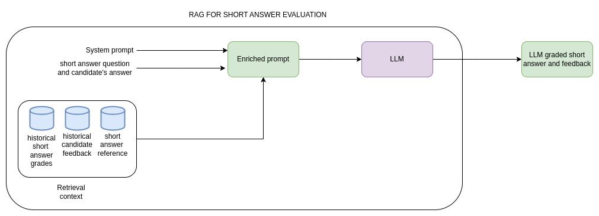

# Grading short answers

## Primary Goal

**HMW implement AI-driven grading models for expert architects so that they can evaluate short-answer submissions 4X faster?**

Refer here for [detailed business requirements](/business-requirements/short-answer-grading-business-requirements.md)

**High-Level User Flow:** [UI Mockup](https://claude.site/artifacts/f0f8e1fc-f904-4f28-9466-125f77e69127?fullscreen=true)

**Key screen:**


## High-Level Solution Approach

Below is the high-level diagram for Test 1. ( see [Implementation Details](#implementation-details))


We will develop an ASAS solution that leverages Large Language Models (LLMs) to automatically grade short answer responses and generate candidate feedback. The solution consists of two key services:

1. ASAS Grader: Grades short answer submissions and provides detailed feedback.
2. ASAS Judge: Assigns a confidence score to the grading outcome, ensuring quality and consistency.

**Workflow:**

- The ASAS Judge provides a confidence score for the generated grading.
- If the confidence score exceeds a configurable threshold, the result is finalized automatically.
- Submissions with scores below the threshold are stored for manual review by Expert Software Architects.
- The manual review outcomes feed back into the ASAS Judge to improve its confidence scoring over time.

This hybrid approach ensures that the AI-generated results closely mimic manual grading. Splitting the Grader and Judge into separate components allows us improve/test one component while keeping the other component constant.

## ASAS Grader Preliminary C3 Diagram

The diagram below illustrates the core components of the AI Grader service. ( see [Implementation Details](#implementation-details))


Note: Due to time constraints and brevity, C3 diagrams for the other components are omitted.

## Implementation Details

Below is a summarised version of the analysis. A more thorough version could be found [here](/usecases/test1-approach.md)

Recent research ([Ref1](https://arxiv.org/abs/2409.20042), [Ref2](https://arxiv.org/abs/2408.03811)) shows that a Retrieval-Augmented Generation (RAG) approach combined with Few-Shot examples and Chain-of-Thought reasoning significantly improves performance in Automated Short Answer Scoring tasks across multiple LLMs—with no fine-tuning. This is the strategy we will adopt. Please refer to this [ADR](/ADRs/003-adr-llm-based-short-answer-evalaution-strategy.md) for a more detailed analysis of this choice.

## ASAS Grader

The ASAS Grader will execute the following steps:

1. Retrieve a short answer submission pending grading.
2. Check for an existing entry in the ASAS database:
   - If an entry exists, bypass further processing and finalize the grade.
   - Otherwise, create a new entry and mark it as “being processed.”
3. Use vector search (with caching and re-ranking) to fetch relevant positively and negatively graded submissions.
4. Retrieve the necessary prompt template from an external Prompt Management System (e.g., Haystack, PromptHub, PromptLayer) that supports versioning and organization.
5. Construct a RAG-based Few-Shot Example Chain-of-Thought prompt to instruct the LLM to evaluate the submission and generate detailed feedback.
6. Filter the prompt using input guardrails to redact malicious or sensitive content.
7. Publish the query to the LLM query queue and subscribe to the LLM response queue.
8. Process the LLM response through output guardrails (to ensure valid structure, appropriate language, etc.).
9. Store the grading result in the ASAS database with a status of “Awaiting Judgement.”
10. Relevant ADRs
    - [Prompt Orchestrator](/ADRs/005-adr-prompt-orchestrator.md)
    - [Structured Output](/ADRs/012-adr-llm-structured-output.md)
    - [Embedding Model](/ADRs/008-adr-llm-embedding-model.md)
    - [Vector Store](/ADRs/014-adr-llm-vector-store.md)
    - [Vector Search](/ADRs/013-adr-llm-vector-search.md)
11. Other links
    - [Example Test 1 Grading Process](/business-requirements/test1-grading-process.md) : Could be used for creating system prompt fot ASAS Grader

## ASAS Judge

The ASAS Judge is responsible for evaluating the quality of the AI-generated grading. It uses various LLM as Judge tools/frameworks to perform it's duties. Its workflow includes:

1. Retrieve a grading submission awaiting judgment.
2. Use the vector search to fetch relevant historical submissions.
3. Retrieve the appropriate prompt template from an external Prompt Management System.
4. Uses the selected LLM evaluation techniques (see [ADR](/ADRs/009-adr-llm-evaluation.md))
5. (Optional) Publish the query to the LLM query queue and subscribe to the LLM response queue.
6. Update the grading submission in the ASAS database with the computed confidence score.
7. Compare the confidence score against a predefined, configurable threshold:
   - If above the threshold, finalize the grading.
   - If below, update the status to “Pending Manual Review.”
8. Integrate the outcomes of manual review to continuously refine the judgment prompt.
9. Relevant ADRs
   - [Observability](/ADRs/011-adr-llm-observability.md)

## AI Model Gateway

The AI Model Gateway orchestrates communication between queued queries and the LLM models. Its responsibilities include:

1. Pulling queries from the LLM query queue and performing generic guardrail checks.
2. Looking up cached responses; if none exist, batching the query for processing.
3. Identifying the appropriate model for each query batch and routing them accordingly.
4. Updating the cache with optimized LLM outputs.
5. Publishing responses to the LLM response queue.
6. Relevant ADRs
   - [AI Gateway](/ADRs/001-adr-using-ai-gateway.md)
   - [LLM Deplyment](/ADRs/007-adr-llm-deployment.md)
   - [Multi Model AI](/ADRs/002-adr-ai-multi-model-strategy.md)

## Prompting strategy



Prompt engineering is a test-driven and iterative process that can enhance model performance. When creating prompts, it is important to clearly define the objectives and expected outcomes for each prompt and systematically test them to identify areas of improvement.

The following diagram shows the prompt engineering workflow:


Following are the components within a well structured prompt that achieves its purpose

- Objective
- Persona
- Instructions
- Context
- Constraints
- Tone
- Output format
- Examples
- Guardrails

For the case of our short answer questions generation, we have considered the following prompt techniques

- Role Prompting(Assigned a role to model)
- Few shot prompting(Provided examples)
- Constraint based prompting(adding constraints or conditions to prompts)
- Chain-of-Thought (CoT) prompting (Step by step process and reasoning)

<details>

<summary>Example prompt</summary>

```

You are an expert architect tasked to grade short answers based on historical grading patterns and answer references. You will receive a set of previously graded short answers and answer references as context and a new short answer that needs to be graded. Your task is to assign a fair and consistent grade and provide feedback to the new short answer based on the given grading patterns.

<INSTRUCTIONS>

Step 1: Analyze the provided historical short answers and their corresponding grades to understand the grading criteria.
Step 2: Compare the new short answer to the historical examples, considering correctness, completeness, relevance, and clarity.
Step 3: Assign a grade that aligns with the grading patterns observed in the historical data.
Step 4: Provide a brief justification explaining why the assigned grade is appropriate based on the retrieved context.

</INSTRUCTIONS>


<INPUT>
Question: What is the Single Responsibility Principle (SRP) in software design?
Candidate answer: The Single Responsibility Principle (SRP) states that a class or module should have only one reason to change, meaning it should focus on a single responsibility. This improves code maintainability and separation of concerns. For instance, in an MVC pattern, controllers handle user input while models manage business logic, ensuring clear boundaries between responsibilities.

</INPUT>

<CONTEXT>
Short Answer 1: The Single Responsibility Principle (SRP) states that a class, module, or function should have only one reason to change, meaning it should handle a single responsibility within a system. Following SRP improves maintainability, reduces coupling, and enhances testability. For example, in an e-commerce system, separating order processing and payment handling into different classes ensures changes in one do not impact the other.
Feedback: This answer is technically accurate, clear, and well-structured. It defines SRP precisely, explains why it is important, and includes a real-world example demonstrating its application. Correct software architecture terminology is used without unnecessary jargon. 
Grade: 10 

Short Answer 2: The Single Responsibility Principle means that a class should only do one thing. This makes the code cleaner and easier to maintain.
Grade: 6
Feedback: While this response captures the basic idea, it lacks depth and clarity. The definition is too vague—"one thing" is not specific enough to convey SRP's full meaning. It does not explain why SRP matters or provide an example. Expanding on "reason to change" and giving a real-world scenario would strengthen the answer.

Reference answer:The Single Responsibility Principle (SRP) states that a class or module should have only one reason to change, meaning it should focus on a single responsibility. Adhering to SRP leads to better modularity, easier debugging, and lower maintenance costs. For instance, in a blogging platform, separating user authentication from content management ensures independent updates without unintended side effects.
</CONTEXT>

<CONSTRAINTS>
<GRADING_CRITERIA>

Each short-answer question is graded on a 10-point scale based on the following criteria:  

1. **Technical Accuracy (40%)** – Does the response reflect correct and industry-standard knowledge?  
2. **Clarity & Conciseness (20%)** – Is the answer clear, precise, and free from unnecessary jargon?  
3. **Application & Justification (25%)** – Does the candidate provide reasoning, examples, or justifications?  
4. **Use of Correct Terminology (15%)** – Are accurate software architecture terms and concepts used?  

Scoring Scale:  
- **9-10 points:** Perfect Answer – Expert-level response with precise examples.  
- **7-8 points:** Competent Answer – Correct, but minor gaps in depth or clarity.  
- **4-6 points:** Needs Improvement – Basic understanding but lacks depth or structure.  
- **0-3 points:** Weak Answer – Superficial, incorrect, or vague response.  
</GRADING_CRITERIA>

Feedback constraints:
  - The feedback should not mention exact score breakdowns or percentages.
  - Instead, it should provide qualitative feedback on strengths and areas for improvement.
  - Use Constructive and Actionable Language
  - The feedback should guide the candidate on how to improve their answer.
  - Avoid vague comments like "Needs improvement" without specifying what to improve.
  - Address Strengths and Weaknesses Clearly
  - Highlight what was done well (e.g., clarity, correct terminology).
  - Point out specific weaknesses (e.g., lack of examples, missing justification).
  - The feedback should be professional, unbiased, and encouraging
  - Avoid overly critical or discouraging language.
  - Ensure Consistency in Evaluations
  - Similar mistakes or gaps should receive similar feedback.
  - The depth of feedback should align with the score assigned.
  - Limit Feedback Length
  - Provide key points without unnecessary verbosity

</CONSTRAINTS>

<OUTPUT_FORMAT>
Assigned Grade: <grade>  
Justification: <explanation>
</OUTPUT_FORMAT>

<EXAMPLES>
Short Answer question: Explain Don’t Repeat Yourself (DRY) principle 
Short Answer 1: The Don't Repeat Yourself (DRY) principle encourages reducing code duplication by reusing existing code through functions or modules. This makes the codebase more organized and easier to manage.  
Grade: 5 
Feedback: Your response correctly identifies the core idea of the DRY principle but lacks depth and justification. While it mentions reducing duplication and improving organization, it does not explain why DRY is important beyond code reusability. Key aspects like maintainability, consistency, and avoiding redundancy across different domains (e.g., databases, infrastructure) are missing. Additionally, the answer does not provide an example or practical application, which would strengthen its effectiveness. Using more precise terminology and expanding on how DRY benefits software development would improve the response.

Short Answer 2: The Don’t Repeat Yourself (DRY) principle emphasizes eliminating redundancy by ensuring each piece of knowledge has a single authoritative representation in a system. It improves maintainability, scalability, and consistency by centralizing logic into reusable functions, modules, or services. For example, instead of duplicating logic in multiple functions, it should be encapsulated in a single function. DRY applies to code, databases, documentation, and infrastructure, reducing errors and improving efficiency. It is widely used in microservices, database normalization, and Infrastructure as Code (IaC).
Grade: 10
Feedback: Your response effectively explains the DRY (Don't Repeat Yourself) principle with clarity and correctness. It concisely highlights how DRY helps in reducing redundancy, improving maintainability, and ensuring consistency across different domains like code, databases, and infrastructure. The inclusion of an example (centralizing logic into reusable functions) strengthens the explanation, making it more practical. Additionally, your use of precise terminology enhances the clarity of the response. Overall, this is a well-structured and insightful answer.

Reference answer: The DRY (Don’t Repeat Yourself) principle promotes eliminating redundancy by ensuring logic is written only once and reused through functions, modules, or abstractions. This improves maintainability, reduces errors, and enhances code clarity. For example, using a common validation function instead of duplicating validation logic across multiple components prevents inconsistencies.
</EXAMPLES>
```
</details>


## Conclusion

- **Summary of Changes:**
   - AI-driven automation replaces manual grading, significantly reducing the time required for evaluating short-answer responses.
   - Structured feedback generation ensures candidates receive detailed, consistent explanations for their scores.
   - Confidence-based review mechanism allows experts to validate AI-generated grades when necessary.
- **Benefits of the New Architecture:**
   - Scalability – Enables grading for thousands of candidates per week without increasing expert workload.
   - Faster Turnaround – Reduces grading time per response, ensuring candidates receive results in hours instead of days.
   - Reduced Manual Workload – Experts focus on validation and edge cases rather than routine grading.
- **Potential Risks & Mitigations:**
   - AI Bias & Inconsistencies – Implementing bias-detection mechanisms and benchmarking AI evaluations against historical grading patterns.
   - Quality Assurance – Expert oversight ensures AI-generated scores align with certification standards.
   - System Adaptability – AI models are periodically retrained using new grading patterns to maintain relevance and accuracy.
- **Next Steps:** Pilot AI grading system, evaluate AI explainability, and refine model accuracy based on real-world data.
